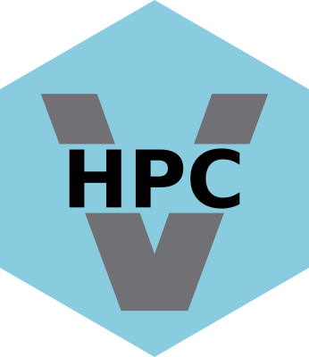

# Virtualized High Performance Computing Toolkit (vHPC Toolkit) 


## Overview 

Due to their extreme demand on performance, HPC workloads often have much 
more intensive resource requirements than those workloads found in the 
typical enterprise. For example, HPC commonly leverages hardware 
accelerators, such as GPU and FPGA for compute as well as RDMA 
interconnects, which require special vSphere configurations. 

This toolkit is intended to facilitate managing the lifecycle of these 
special configurations by leveraging vSphere APIs. It also includes features 
that help vSphere administrators perform some common vSphere tasks that are 
related to creating such high-performing environments, such as VM cloning, 
setting Latency Sensitivity, and sizing vCPUs, memory, etc.

## Try It Out

### Prerequisites

OS for using this toolkit: Linux or Mac <br/>
vSphere >=6.5 <br/>
Python >=3.7 <br/> 

### Install 

Package dependencies will be isolated in a Python virtual environment by 
```virtualenv```. This 
allows us to have different versions of dependencies. 

To install ```virtualenv``` if you don't have one, for example, 

- For Mac: 
```pip install --upgrade virtualenv```
- For Ubuntu: 
```sudo apt-get install python3-pip```; ```sudo pip3 install virtualenv```


Setup this toolkit with an virtual env:
 
```bash 
git clone https://github.com/vmware/vhpc-toolkit.git
cd vhpc-toolkit
virtualenv -p python3 venv
source venv/bin/activate
pip install -r requirements.txt
pip install vhpc_toolkit
```

If you want to actively modify the toolkit, it is recommended to install it in "develop" mode
```bash
pip install -e <folder_with_setup.py>
# If setup.py is in current folder
pip install -e .
```

### Secure Setup via Vault 

This toolkit leverages vSphere APIs to manage vSphere objects (such as VMs, 
distributed virtual switches). So it needs connection to vCenter. In order 
to enable the possibility of automation (without prompting password every 
operation), as one option, you could put your vCenter information in 
```vCenter.conf``` under ```vhpc_toolkit/config``` or ```~/vhpc_toolkit```, 
such as 

```text  
# vCenter configuration 
server: 192.168.0.1 
username: mySecretUsername
password: mySecretPassword
```
  
However, it's NOT secure to explicitly store your sensitive information in a 
plain text file. So we enable [Vault](https://learn.hashicorp.com/vault) 
integration. With Vault, the setup procedure is like this: 
  
1. Follow [Vault](https://learn.hashicorp.com/tutorials/vault/getting-started-install?in=vault/getting-started) instructions to install 
Vault and setup a Vault server if you don't have one
  
2. Connect to Vault server by `export VAULT_ADDR=xx` and `export 
VAULT_TOKEN=xx` environment variables 

3. Store your vCenter secrets as key value pairs under a secret path into the
 Vault server, e.g. 

```
vault kv put secret/vCenter vcenter-hostname=192.168.0.1 vcenter-username=mySecretUsername vcenter-password=mySecretPassword
```

4. Finally, you can directly put your keys in ```vCenter.conf``` file as:  
  
```text  
# vCenter configuration 
vault: yes
vault_secret_path: vCenter
server: vcenter-hostname
username: vcenter-username
password: vcenter-password
```

For more advanced features of Vault, such as managing token leases, dynamic 
secrets and Web UI, please refer to  [Vault](https://learn.hashicorp.com/vault). 

### Verification 

After proper installation and setup, you should be able to execute `
./vhpc_toolkit --help` under `vhpc_toolkit/bin` folder to view all available 
operations. Use ```./vhpc_toolkit view``` as a quick test. 

## Documentation
Please refer to our [Documentation Site](https://vmware.github.io/vhpc-toolkit/#/)

## Additional functions 
Please share your ideas

## Contributing

The vhpc-toolkit project team welcomes contributions from the community. Before you start working with vhpc-toolkit, please
read our [Developer Certificate of Origin](https://cla.vmware.com/dco). All contributions to this repository must be
signed as described on that page. Your signature certifies that you wrote the patch or have the right to pass it on
as an open-source patch. For more detailed information, refer to [CONTRIBUTING.md](https://vmware.github.io/vhpc-toolkit/#/contribute).

## License

This toolkit is available under the [Apache 2 license](https://vmware.github.io/vhpc-toolkit/#/license).


